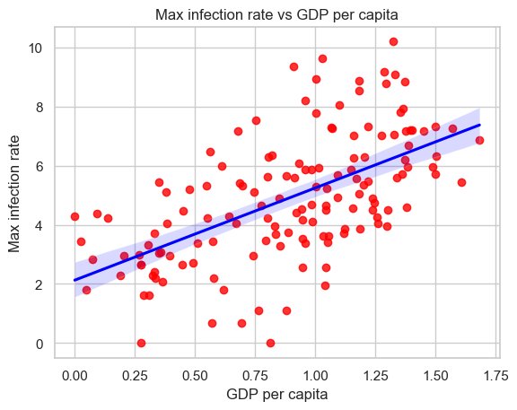

<a name="readme-top"></a>

<div align="center">

  
  <br/>

</div>

<!-- TABLE OF CONTENTS -->

# 📗 Table of Contents

- [📖 About the Project](#about-project)
  - [🛠 Built With](#built-with)
- [💻 Getting Started](#getting-started)
  - [Prerequisites](#prerequisites)
  - [Setup](#setup)
- [👥 Authors](#authors)
- [🤝 Contributing](#contributing)
- [⭐️ Show your support](#support)
- [🙏 Acknowledgements](#acknowledgements)
- [📝 License](#license)

<!-- PROJECT DESCRIPTION -->

# 📖 COVID-19 Data Analysis <a name="about-project"></a>

The COVID-19 Data Analysis project is an in-depth exploration conducted in Python and Jupyter Notebooks. Leveraging powerful libraries such as Pandas, NumPy, Seaborn, and Matplotlib, the study aims to establish a correlation between the COVID infection rate and the World Happiness Record, a dataset endorsed by the United Nations. The analysis delves into various variables, including GDP per capita, to decipher meaningful patterns and relationships.



</br>

## 🛠 Built With <a name="built-with"></a>


<details>
  <summary>Tech Stack</summary>
  <ul>
    <li>Python</li>
    <li>Jupyter Notebooks</li>
  </ul>
</details>

<!-- GETTING STARTED -->

## 💻 Getting Started <a name="getting-started"></a>

To get a local copy up and running, follow these steps.

### Prerequisites

- Visual Studio Code
- Anaconda
- Python and Jupyter VS extensions
- ipykernel
- Git Bash
- NPM installed locally

### Setup

Clone this repository to your desired folder:

```sh
git clone https://github.com/HunterX-7/COVID-19-Data-Analysis.git
```

<!-- AUTHORS -->

## 👥 Author <a name="authors"></a>

👤 **Francisco Quintero**

- GitHub: [@HunterX-7](https://github.com/HunterX-7)
- LinkedIn: [Francisco Quintero](https://www.linkedin.com/in/francisco-asis-quintero-cede%C3%B1o/)

<!-- CONTRIBUTING -->

## 🤝 Contributing <a name="contributing"></a>

Contributions, issues, and feature requests are welcome!

Feel free to check the [issues page](https://github.com/HunterX-7/COVID-19-Data-Analysis/issues).

<!-- SUPPORT -->

## ⭐️ Show your support <a name="support"></a>

Give a ⭐️ if you like this project!

<!-- Acknowledgments -->

## 🙏 Acknowledgments <a name="acknowledgements"></a>

Hat tip to anyone whose code was used.

<!-- LICENSE -->

## 📝 License <a name="license"></a>

This project is [MIT](./LICENSE) licensed.

<p align="right">(<a href="#readme-top">Back to top</a>)</p>
